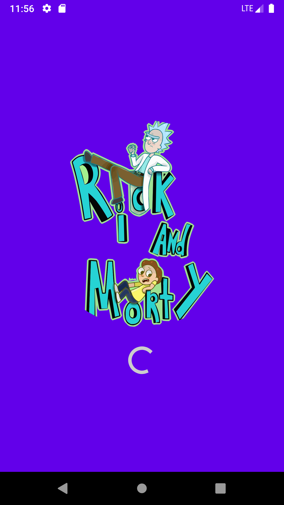
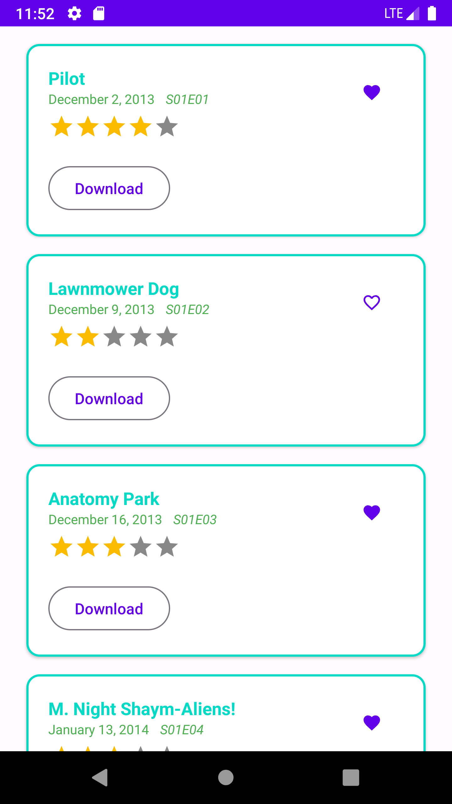
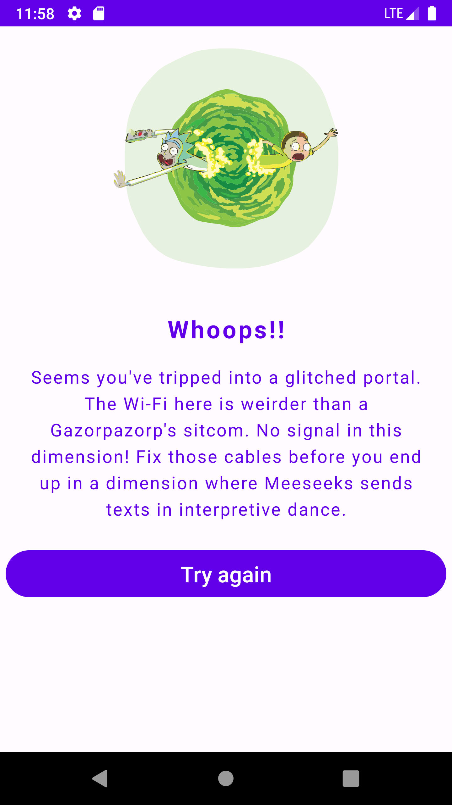

# Rick and Morty Episode Viewer App

  

## Description
This application, entirely written in Kotlin using Jetpack Compose, provides an interface for viewing episodes of the "Rick and Morty" series. The architecture used is Clean Architecture with the support of Android's Architecture Components.

### Jetpack Compose
Jetpack Compose was chosen as the primary UI framework due to its declarative nature and ability to simplify UI development. It provides a concise and efficient syntax for building modern and appealing user interfaces.

### Clean Architecture
The architecture follows the principles of Clean Architecture, clearly separating the presentation, domain, and data layers. This facilitates maintenance, scalability, and testing of each layer separately.

- **Presentation Layer (UI):** Implemented with Jetpack Compose. This is where presentation logic and user interactions reside.

- **Domain Layer:** Contains business logic and business rules. It is independent of the concrete framework implementation.

- **Data Layer:** Manages data access, whether from a remote API, local database, or any other data source.

### Android Architecture Components
The Android Architecture Components are used to provide an organizational structure and a set of tools for developing robust and maintainable applications. LiveData and ViewModel are employed to handle UI lifecycle and data management efficiently.

### Testing
Tests have been created for key components of each layer of the architecture:

- **Business Logic Tests:** Unit tests have been created for the business logic in the domain layer. These tests ensure that business rules work correctly without depending on external infrastructure.

- **Remote Access Tests:** Unit tests verify the interaction with remote data sources in the data layer, ensuring that data retrieval from APIs is functioning as expected.

- **Presentation Logic Tests:** Unit tests have been created for the presentation layer. These tests ensure that the ViewModel responds correctly to user interactions.

## Project Structure
- **ui:** All Jetpack Compose composables and reusable components.

- **presentation:** Contains the implementation of the presentation layer logic.

- **domain:** Contains the business logic and business rules of the application.

- **data:** Manages data access, including repository implementations, services, and data sources.

- **di:** Contains the dependency injection setup using Dagger Hilt.

## Running Tests
To run the tests, you can use the following commands in the terminal:

```bash
./gradlew test       # Run unit tests